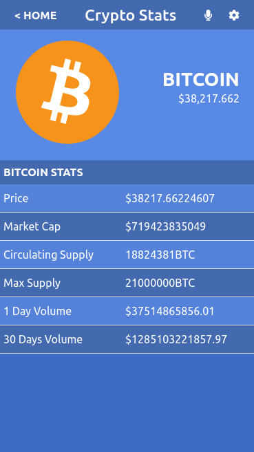

# Crypto Data
This is a Mobile React web application that gets data from [Nomics API](https://nomics.com), and displays cryptocurrency data.




Additional description of the project and its features.

## 🔴  Live Demo

[Cryptocurrency Data](https://modest-shannon-8c147f.netlify.app)

## Project Overview Video

[Watch Here](https://www.loom.com/share/1521de36139a491b9f2fda2ec9e2415c)

## Built With

- HTML
- CSS
- React
- Redux

## Getting Started

To get a local copy up and running follow these simple steps inside the root folder.

### Setup

Install dependencies with:

```
npm install
```

### Usage

Start server with:

```
npm start
```

it will open `http://localhost:3000/` in your default browser.

## Authors

👤 **Onesis Olea**

- Github: [2bleO](https://github.com/2bleO)
- Linkedin: [Onesis Olea](https://www.linkedin.com/in/onesis-olea/)
- Twitter: [@OleaOnesis](https://twitter.com/OleaOnesis)

## 🤝 Contributing

Contributions, issues and feature requests are welcome!

Feel free to check the [issues page]().

## Show your support

Give a ⭐️ if you like this project!

## Acknowledgments

- Microverse
- Original design idea by [Nelson Sakwa on Behance ](https://www.behance.net/gallery/31579789/Ballhead-App-(Free-PSDs))
- Powered by [Nomics API](https://nomics.com)
## 📝 License

This project is MIT Lisenced